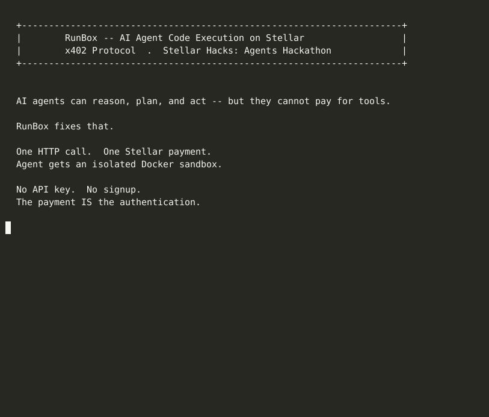

<p align="center">
  
</p>

<h3 align="center">Pay-per-use isolated code execution for AI agents</h3>
<h4 align="center">Powered by x402 + Machine Payment Protocol on Stellar</h4>

<p align="center">
  <a href="https://www.npmjs.com/package/runbox-client"></a>
  <a href="https://www.npmjs.com/package/runbox-mcp"></a>
  <a href="https://github.com/daraijaola/Runbox/blob/main/LICENSE"></a>
  <a href="https://lab.stellar.org/r/testnet/contract/CCXVU6NNDBJ23QSG6OGKUMUEXNLVOSJ4SZOJK3AAL2NTHBCAED66SCG3"></a>
  
  
</p>

<p align="center">
  <a href="https://youtu.be/qUWUI5Xn160">Demo Video</a> &bull;
  <a href="https://www.npmjs.com/package/runbox-client">npm SDK</a> &bull;
  <a href="https://www.npmjs.com/package/runbox-mcp">MCP Server</a> &bull;
  <a href="https://lab.stellar.org/r/testnet/contract/CCXVU6NNDBJ23QSG6OGKUMUEXNLVOSJ4SZOJK3AAL2NTHBCAED66SCG3">Soroban Contract</a>
</p>

---

## The Problem

AI agents can reason, plan, and act &mdash; but the moment they need to run code, they hit a wall. Existing sandboxes require API keys, manual signup, human approval, and monthly subscriptions. None of that works for autonomous agents operating at machine speed.

## The Solution

RunBox lets any AI agent execute code in a secure Docker sandbox by paying **0.01 USDC on Stellar**. No API key. No account. No human in the loop. **The payment is the credential.**

<p align="center">
  
</p>

> **[View live transaction on Stellar Expert](https://stellar.expert/explorer/testnet/tx/9c4d173e14bbc5fdbaa66fc617483c09d9d16b6bf41e1e2abd70e684d7b1eab1)** &mdash; 0.01 USDC paid, verified on-chain, code executed in 319ms.

---

## How It Works

```
Agent                     RunBox Server                  Stellar
  |                            |                            |
  |  1. POST /exec/rent        |                            |
  |  (with X-Payment-Hash)     |                            |
  |--------------------------->|                            |
  |                            |  2. Verify tx on Horizon   |
  |                            |--------------------------->|
  |                            |  3. Confirmed: 0.01 USDC   |
  |                            |<---------------------------|
  |  4. Session token (JWT)    |                            |
  |<---------------------------|                            |
  |                            |                            |
  |  5. POST /exec/run         |                            |
  |  Authorization: Bearer ... |                            |
  |  { language, code }        |                            |
  |--------------------------->|                            |
  |                            |  6. Spin up Docker          |
  |                            |     (isolated, no network)  |
  |  7. { stdout, stderr,      |                            |
  |       exitCode, duration } |                            |
  |<---------------------------|                            |
```

---

## Features

| | Feature | Description |
|---|---------|-------------|
| **x402** | Session payments | Pay once, execute many times within a session window |
| **MPP** | Pay-per-request | Per-call micropayments via Soroban SAC &mdash; no session needed |
| **19** | Languages | Python, JavaScript, TypeScript, Go, Rust, Java, C, C++, Ruby, PHP, Perl, Lua, R, Bash, and more |
| **SSE** | Streaming output | `POST /run-stream` &mdash; stdout/stderr streamed in real-time |
| **I/O** | File support | Send files into the sandbox, get output files back (base64) |
| **MCP** | IDE integration | Claude Desktop and Cursor call RunBox natively |
| **SDK** | npm package | `npm install runbox-client` &mdash; one-line integration |
| **Soroban** | Spending caps | On-chain budget enforcement &mdash; agents cannot overspend |
| **OpenClaw** | Skill | `clawhub install runbox` &mdash; instant agent integration |
| **Docker** | Isolation | No network, 128 MB RAM, 0.5 CPU, 60s timeout per execution |
| **36** | Tests | Payment verification, sessions, sandbox, API integration |

---

## Quick Start

### Install the SDK

```bash
npm install runbox-client
```

```typescript
import { RunBox } from "runbox-client";

const box = new RunBox();

// Pay for a session (x402 flow)
const session = await box.rent("<stellar_tx_hash>");

// Execute code
const result = await box.exec("python", "print(hello from RunBox)");
console.log(result.stdout); // "hello from RunBox"

// Stream output in real-time
for await (const event of box.execStream("python", "for i in range(5): print(i)")) {
  if (event.type === "stdout") process.stdout.write(event.data);
}

// File I/O
const fileResult = await box.execWithFiles("python",
  "open(/output/result.txt,w).write(open(/input/data.txt).read().upper())",
  [{ name: "data.txt", content: btoa("hello world") }]
);

// MPP (pay-per-request, no session needed)
const mppResult = await box.mppExec("python", "print(42)");
```

### MCP Server (Claude Desktop / Cursor)

```bash
npm install -g runbox-mcp
```

Add to your Claude Desktop config:

```json
{
  "mcpServers": {
    "runbox": {
      "command": "npx",
      "args": ["runbox-mcp"],
      "env": { "RUNBOX_SESSION_TOKEN": "<your_session_token>" }
    }
  }
}
```

Then ask Claude: *"Run this Python code: print(2**256)"* &mdash; it just works.

### OpenClaw

```bash
clawhub install runbox
```

### Direct HTTP

```bash
# 1. Pay and get session
curl -X POST http://46.101.74.170:4001/api/exec/rent \
  -H "X-Payment-Hash: <stellar_tx_hash>"

# 2. Execute code
curl -X POST http://46.101.74.170:4001/api/exec/run \
  -H "Authorization: Bearer <session_token>" \
  -H "Content-Type: application/json" \
  -d '{"language":"python","code":"print(42)"}'
```

---

## API Reference

### x402 Session Flow

| Method | Endpoint | Auth | Description |
|--------|----------|------|-------------|
| `POST` | `/api/exec/rent` | `X-Payment-Hash` | Pay 0.01 USDC, receive JWT session token |
| `POST` | `/api/exec/run` | `Bearer <token>` | Execute code in isolated container |
| `POST` | `/api/exec/run-stream` | `Bearer <token>` | Execute with SSE streaming output |
| `POST` | `/api/exec/run-files` | `Bearer <token>` | Execute with file input/output |
| `POST` | `/api/exec/extend` | `Bearer <token>` + `X-Payment-Hash` | Extend session TTL |
| `GET` | `/api/exec/status` | `Bearer <token>` | Check session remaining time |

### Machine Payment Protocol (MPP)

| Method | Endpoint | Auth | Description |
|--------|----------|------|-------------|
| `POST` | `/api/mpp/exec` | `Payment-Receipt` | Pay-per-request via Soroban SAC transfer |

### System

| Method | Endpoint | Description |
|--------|----------|-------------|
| `GET` | `/api/healthz` | Health check |

---

## Soroban Spending Cap Contract

On-chain budget enforcement for AI agents. Even if RunBox is compromised, the contract limits what agents can spend.

**Contract ID:** [`CCXVU6NNDBJ23QSG6OGKUMUEXNLVOSJ4SZOJK3AAL2NTHBCAED66SCG3`](https://lab.stellar.org/r/testnet/contract/CCXVU6NNDBJ23QSG6OGKUMUEXNLVOSJ4SZOJK3AAL2NTHBCAED66SCG3)

| Function | Caller | Description |
|----------|--------|-------------|
| `init(admin, service)` | Admin | Initialize with RunBox service address |
| `register_budget(agent, total, per_call)` | Agent | Set spending limits |
| `authorize_spend(agent, amount)` | RunBox | Check + deduct budget atomically |
| `get_budget(agent)` | Anyone | Read remaining budget |
| `pause_budget(agent)` | Agent | Emergency stop |
| `resume_budget(agent)` | Agent | Resume after pause |

**Verified testnet transactions:**

| Action | Transaction |
|--------|-------------|
| Deploy | [`24ded3d6...`](https://stellar.expert/explorer/testnet/tx/24ded3d6b082300773b466cc6c8da856703376e60034fb26c50f51d61f1a4160) |
| Init | [`1427320d...`](https://stellar.expert/explorer/testnet/tx/1427320d2d25191e80bda3e8294182c5cf9148cb6e860ff2f65473a11d7e570e) |
| Register budget | [`1dd88666...`](https://stellar.expert/explorer/testnet/tx/1dd88666cd8dec352a2820bf760dae9e003b90d84c1b0ee6a178bf98d8f27ef5) |
| Authorize spend | [`b3ffd803...`](https://stellar.expert/explorer/testnet/tx/b3ffd8038f006e75de34d3542839b97e511d2a2f55be3cb5bf45d07813339073) |

---

## Security

RunBox is built with defense in depth:

- **Network isolation** &mdash; Containers run with `--network none`
- **Resource limits** &mdash; 128 MB RAM, 0.5 CPU cores per execution
- **Timeout** &mdash; Hard 60-second kill
- **Replay protection** &mdash; Each Stellar tx hash is single-use
- **On-chain verification** &mdash; Payments verified directly against Stellar Horizon
- **Spending caps** &mdash; Soroban contract enforces agent budgets on-chain
- **No persistent storage** &mdash; Containers are destroyed after each execution

---

## Project Structure

```
runbox/
  artifacts/api-server/         Express + TypeScript API server
    src/
      routes/
        exec.ts                 x402 session + execution endpoints
        mpp-exec.ts             MPP pay-per-request endpoint
      lib/
        sandbox.ts              Docker execution engine (19 languages)
        payment.ts              Stellar USDC verification via Horizon
        sessions.ts             JWT session management
        mpp.ts                  MPP server (@stellar/mpp)
      __tests__/                36 tests (vitest)
  packages/
    runbox-client/              npm SDK (runbox-client)
    runbox-mcp/                 MCP server (runbox-mcp)
  contracts/
    spending-cap/               Soroban spending-cap contract (Rust)
  skill/                        OpenClaw skill definition
  demo/                         Demo agents and examples
  docs/                         Logo, demo GIF, demo video
```

---

## Tech Stack

| Layer | Technology |
|-------|------------|
| Runtime | TypeScript, Node.js, Express 5 |
| Payments | Stellar SDK, x402, @stellar/mpp, mppx |
| Smart Contract | Rust, Soroban |
| Sandbox | Docker (per-execution containers) |
| Testing | Vitest (36 tests) |
| SDK | runbox-client (npm) |
| IDE | runbox-mcp (MCP SDK) |
| Logging | Pino |

---

## Links

| | |
|---|---|
| **Live server** | http://46.101.74.170:4001 |
| **Demo video** | https://youtu.be/qUWUI5Xn160 |
| **npm: runbox-client** | https://www.npmjs.com/package/runbox-client |
| **npm: runbox-mcp** | https://www.npmjs.com/package/runbox-mcp |
| **Soroban contract** | [View on Stellar Lab](https://lab.stellar.org/r/testnet/contract/CCXVU6NNDBJ23QSG6OGKUMUEXNLVOSJ4SZOJK3AAL2NTHBCAED66SCG3) |
| **OpenClaw install** | `clawhub install runbox` |

---

## License

[MIT](LICENSE)
